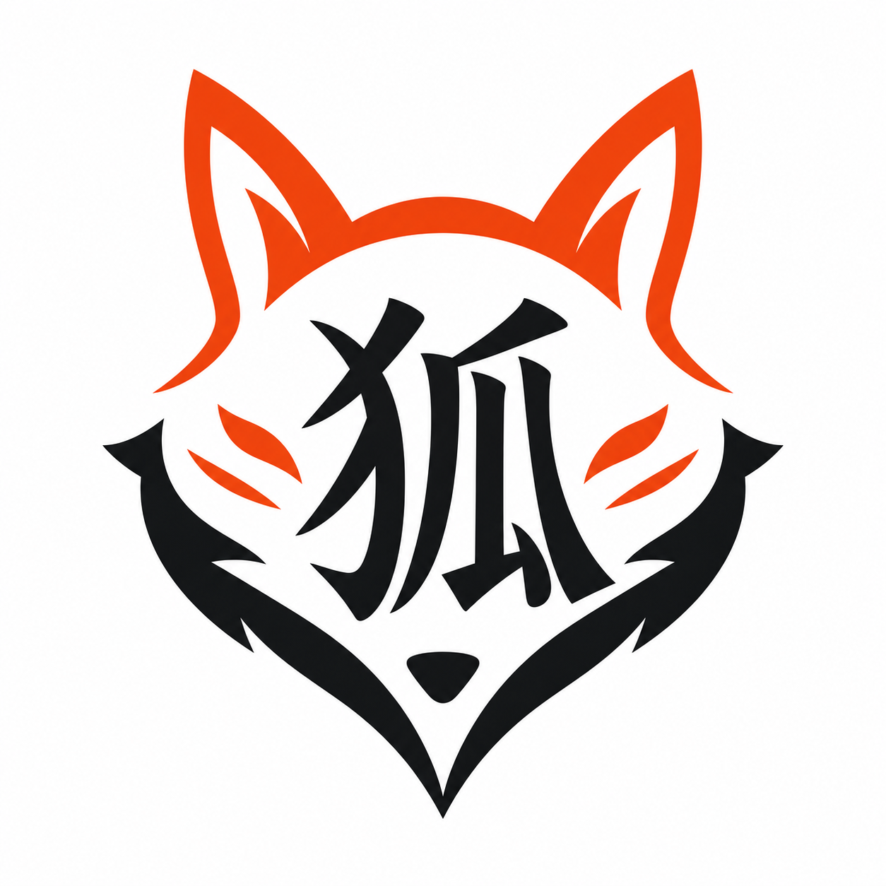
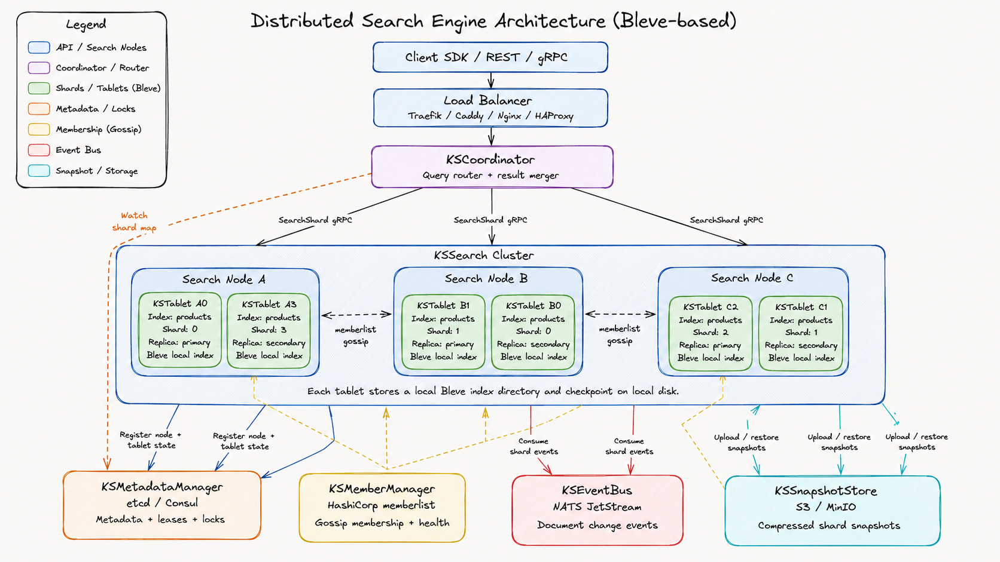

# Kitsune



Kitsune is a Go distributed search engine built around Bleve shard replicas. The project is being implemented from the product roadmap in `docs/roadmaps` and the milestone plans in `docs/superpowers/plans`.



## Architecture

Kitsune splits each logical index into fixed shards. Each shard is hosted by one or more `KSTablet` replicas on search nodes. A `KSCoordinator` receives client requests, keeps an in-memory shard route cache from metadata, fans search out to one healthy replica per shard over gRPC, and merges shard results into one response.

Core components:

- `KSTablet`: one local Bleve index for one shard replica.
- `KSSearchNode`: hosts tablets and exposes internal gRPC search APIs.
- `KSCoordinator`: REST entrypoint for index management, document writes, search, and cluster status.
- `KSMetadataManager`: etcd-first metadata interface for indexes, routes, tablet state, checkpoints, and snapshot pointers.
- `KSEventBus`: NATS JetStream document events for eventually consistent indexing.
- `KSSnapshotStore`: S3-compatible storage for shard snapshots and replica bootstrap.

## Current Implementation

The current codebase contains the first distributed-search slices:

- Bleve-backed tablet open, upsert, delete, search, metadata, and mapping-version checks.
- Search-node gRPC API and tablet registry.
- REST coordinator index creation, document write validation, search fan-out, result merge, and cluster status.
- Static multi-index shard routing with replica selection.
- etcd and in-memory metadata manager implementations with snapshots and watches.
- Document event validation, in-memory event bus, JetStream publication boundary, and replay applier.
- Tombstone-aware replay ordering and compaction-safe checkpoint evidence.
- Compressed snapshot packaging, checksum verification, S3-compatible storage, and trusted restore boundaries.
- HashiCorp memberlist advisory health cache surfaced through cluster status.

Search is eventually consistent. A coordinator document write is accepted after the document event is published. The replay applier validates shard identity, applies events to tablets, acknowledges messages after successful apply, and persists checkpoints. Gossip health is advisory only; shard ownership and tablet readiness stay anchored in metadata.

## Development

Run the full test suite:

```powershell
go test ./...
```

Run the currently focused packages:

```powershell
go test ./internal/tablet ./internal/searchnode ./internal/coordinator ./internal/metadata ./internal/events ./internal/replay ./internal/snapshot ./internal/member ./internal/status
```

Format and vet before committing:

```powershell
gofmt -w .
go vet ./...
```

The local race test currently requires cgo and a C compiler on Windows. Install GCC or use a Go environment with cgo support before running:

```powershell
go test -race ./...
```

## Roadmap

The implementation is intentionally milestone-driven. Start with:

- Product requirements: `docs/prd/prd-kitsune-distributed-search-engine.md`
- Roadmap index: `docs/roadmaps/index.md`
- Detailed specs: `docs/superpowers/specs`
- Execution plans: `docs/superpowers/plans`
